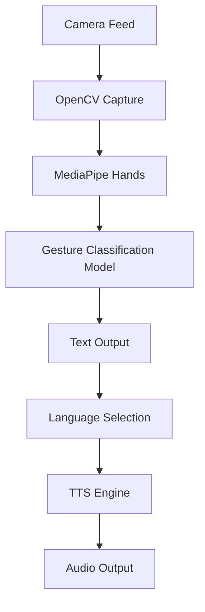

# Sign2Text with Voice Output - Architecture Design

## Overview
This application will use computer vision to detect sign language gestures from a camera feed and convert them to text, then speak the recognized sign in the user's chosen language (Hindi or English).

## Components

### 1. Camera Capture Module
- Uses OpenCV to access webcam
- Captures real-time video feed
- Processes frames for gesture recognition

### 2. Gesture Recognition Module
- Uses MediaPipe Hands for hand landmark detection
- Custom TensorFlow Lite model for sign classification
- Supports multiple sign types:
  - ASL alphabets (A-Z)
  - Numbers (0-9)
  - Common words (hello, thank you, please)
  - Basic ISL signs

### 3. Text-to-Speech Module
- Uses pyttsx3 (free offline TTS engine)
- Supports Hindi and English languages
- Provides language selection option

### 4. Main Application Loop
- Integrates all modules
- Real-time processing pipeline
- User interface for language selection

## Data Flow
1. Camera captures frame
2. MediaPipe detects hand landmarks
3. Custom model classifies the gesture
4. Recognized sign is converted to text
5. TTS engine speaks the text in selected language

## Dependencies
- opencv-python
- mediapipe
- tensorflow-lite (or full TensorFlow)
- pyttsx3
- numpy

## Architecture Diagram

## Implementation Plan
1. Set up project structure with separate modules
2. Implement camera capture
3. Integrate MediaPipe for hand tracking
4. Train/build gesture recognition model
5. Add TTS functionality
6. Create main application script
7. Add user interface elements